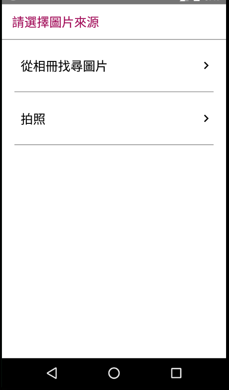
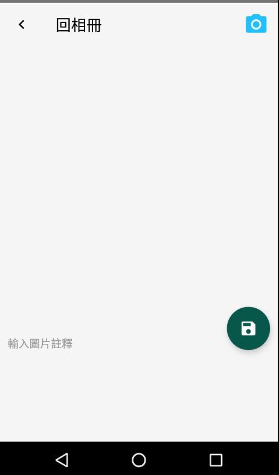

# PictureNoteApp
這是一個能夠幫照片增加註釋的 App

## Version
目前使用 Camera2 API，所以只有支援 Android 5.0 (API 21) 以上

## Description
我們有時後在拍完照之後需要幫這張照片增加一些註解：
<br/>比如這張照片是在哪裡拍的？或是這張照片當時的一些情況想要記錄下來？
<br/>本 App 提供了如此的功能!
<br/><br/>
本 App 分為三個 Activity，各職責和內容敘述如下：
```
MainActivity：
```

<br/>主頁，尋問使用者要從相冊找尋照片 或是 用相機拍攝新的照片
<br/>同時也負責跟 裝置API >= 23 的使用者動態要求 
1. External Storage 的 權限
2. Camera 的權限
```
PictureInformationActivity：
```

<br/>負責接收及處理使用者選擇 照片 完之後的處理動作
<br/>可以在這邊針對相冊裡面每一張照片進行 10 行以內的註釋
```
CameraActivity：
```

<br/>這個 Activity 是基於[googlesamples 的 android-Camera2Basic 專案](https://github.com/googlesamples/android-Camera2Basic)
<br/>但是因為各廠牌的裝置都有不同特性，導致這個專案卻不夠完整，所以修改了一些邏輯
1. 根據本人理解，因為有些裝置就算顯示"自動對焦功能"無服務狀態，仍然還是提供對焦功能
   <br/>所以這邊在 takePicture() 方法當中判斷是否有服務，如果無服務的話就直接進入拍照程序
   <br/>( 即不經過對焦狀況判斷，直接調用拍照方法captureStillPicture() )
2. 另外在 CameraCaptureSession.CaptureCallback 裡，當判斷對焦方法是STATE_WAITING_LOCK
   <br/>並且CaptureResult物件的狀態是CONTROL_AF_STATE_PASSIVE_SCAN (也就是對焦中的狀態)
   <br/>也呼叫拍照方法 captureStillPicture()，因為有些裝置就算對焦完成也會一直卡在這個狀態
   <br/>導致無法進行後續拍照的動作。
